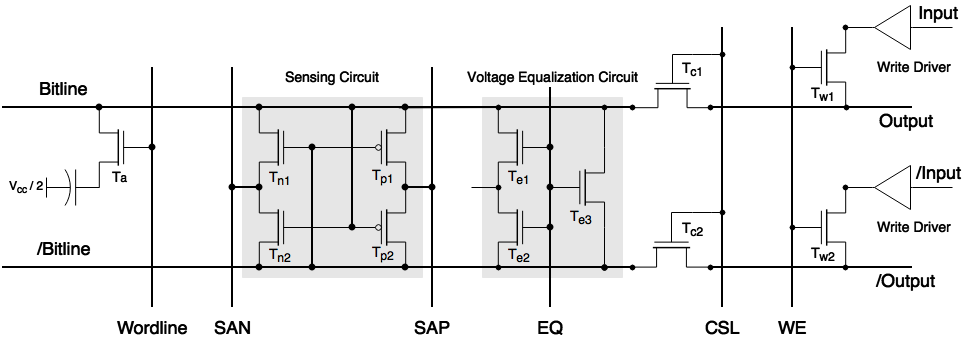
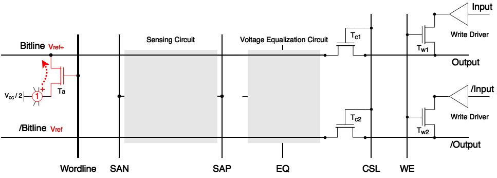
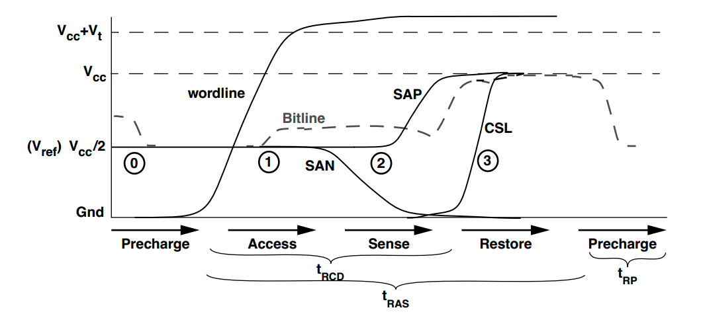

 # DRAM Storage Cell

## Storage Capacitor

DRAM Storage Cell 使用 Storage Capacitor 来存储 Bit 信息。

从原理层面上看，一个最简单的，存储一个 Bit 信息的 DRAM Storage Cell 的结构如下图所示：

由以下 4 个部分组成：

* Storage Capacitor，即存储电容，它通过存储在其中的电荷的多和少，或者说电容两端电压的高和低，来表示逻辑上的 1 和 0。
* Access Transistor，即访问晶体管，它的导通和截止，决定了允许或禁止对 Storage Capacitor 所存储的信息的读取和改写。
* Wordline，即字线，它决定了 Access Transistor 的导通或者截止。 
* Bitline，即位线，它是外界访问 Storage Capacitor 的唯一通道，当 Access Transistor 导通后，外界可以通过 Bitline 对 Storage Capacitor 进行读取或者写入操作。

### 数据读写原理

从上面的结构图上分析，我们可以很容易的推测出 DRAM Storage Cell 的数据读写流程：

1. 读数据时，Wordline 设为逻辑高电平，打开 Access Transistor，然后读取 Bitline 上的状态
2. 写数据时，先把要写入的电平状态设定到 Bitline 上，然后打开 Access Transistor，通过 Bitline 改变 Storage Capacitor 内部的状态。

然而，在具体实现上，如果按照上面的流程对 DRAM Storage Cell 进行读写，会遇到以下的问题：

**1. 外界的逻辑电平与 Storage Capacitor 的电平不匹配**  

Storage Capacitor 在电容一定的情况下，存储的电荷越少，充放电的时间就会越短，也就意味着写入的性能更好。  
在实际的 DRAM 实现中，为了获取更好的写入性能，通常只会在 Storage Capacitor 存储少量的电荷。因此，当 Access Transistor 导通时，Bitline 上呈现的电压通常是要远远低于外界电路的逻辑电平。外界电路无法直接通过 Bitline 来读取 Storage Capacitor 所存储的信息。

**2. 进行一次读取操作后，Storage Capacitor 存储的电荷会变化**  

在进行一次读取操作的过程中，Access Transistor 导通后，由于 Bitline 和 Storage Capacitor 端的电压不一致，会导致 Storage Capacitor 中存储的电荷量被改变。最终可能会导致在下一次读取操作过程中，无法正确的读出 Storage Capacitor 内存储的信息。

为解决上述的问题，DRAM 在设计上，引入了 Differential Sense Amplifier。

## Differential Sense Amplifier

Differential Sense Amplifier 包含 Sensing Circuit 和 Voltage Equalization Circuit 两个主要部分。它主要的功能就是将 Storage Capacitor 的电压转换为逻辑 1 或者 0 所对应的电压，并且呈现到 Bitline 上。同时，在完成一次读取操作后，通过 Bitline 将 Storage Capacitor 中的电荷恢复到读取之前的状态。

在后面的小节中，我们通过完整的数据读取和写入过程，来了解 Differential Sense Amplifier 工作原理。

## Read Operation

一个完整的 Read Operation 包含了，Precharge、Access、Sense、Restore 四个阶段。后续的小节中，将描述从 Storage Capacitor 读取 Bit 1 的完整过程。

### Precharge

在这个阶段，首先会通过控制 EQ 信号，让 Te1、Te2、Te3 晶体管处于导通状态，将 Bitline 和 /Bitline 线上的电压稳定在 Vref 上。然后进入到下一个阶段。

### Access

经过 Rrecharge 阶段， Bitline 和 /Bitline 线上的电压已经稳定在 Vref 上了，此时，通过控制 Wordline 信号，将 Ta 晶体管导通。由于 Storage Capacitor 中存储正电荷，Ta 导通后，会将 Bitline 线上的电压拉升到 Vref+。然后进入到下一个阶段。 

### Sense

由于在 Access 阶段，Bitline 的电压被拉升到 Vref+，Tn2 会被导通，Tp2 则处于截止。  
此时，SAN (Sense-Amplifier N-Fet Control) 会被设定为逻辑 0 的电压，SAP (Sense-Amplifier P-Fet Control) 则会被设定为逻辑 1 的电压。由于 Tn2 处于导通状态，/Bitline 上的电压很快会被 SAN 拉到逻辑 0 电压，继而让 Tp1 进入导通状态，Tn1 进入截止状态。又由于 Tp1 进入了导通状态，Bitline 上的电压很快会被 SAP 拉到逻辑 1 电压。  
最后，Bitline 和 /Bitline 的电压都进入稳定状态，正确的呈现了 Storage Capacitor 所存储的信息 Bit。

### Restore

在完成 Sense 阶段的操作后，Bitline 线处于稳定的逻辑 1 电压，此时 Bitline 会对 Storage Capacitor 进行充电。经过特定的时间后，当 Storage Capacitor 的电荷恢复到读取操作前的状态时，就可以通过控制 Wordline，将 Storage Capacitor 的 Access Transistor Ta 截止。

期间，通过 CSL 信号，让 Tc1 和 Tc2 进入导通状态，外界就可以从 Bitline 上读取到具体的信息。

### Timing

整个 Read Operation 的时序如下图所示，其中的 Vcc 即为逻辑 1 所对应的电压，Gnd 为逻辑 0。

## Write Operation

Write Operation 的前期流程和 Read Operation 是一样的，执行 Precharge、Access、Sense 和 Restore 操作。差异在于，在 Restore 阶段中， Wordline 让 Access Transistor 截止前，会进行 Write Recovery 操作。

### Write Recovery  

在 Write Recovery 阶段时，通过控制 WE (Write Enable) 信号，让 Tw1 和 Tw2 进入导通状态。此时，Bitline 会被 input 拉到逻辑 0 电平，/Bitline 则会被 /input 拉到逻辑 1 电平。  
经过特定的时间后，当 Storage Capacitor 的电荷被 Discharge 到 0 状态时，就可以通过控制 Wordline，将 Storage Capacitor 的 Access Transistor 截止，写入 0 的操作就完成了。

## 参考资料

1. Memory Systems - Cache Dram and Disk
